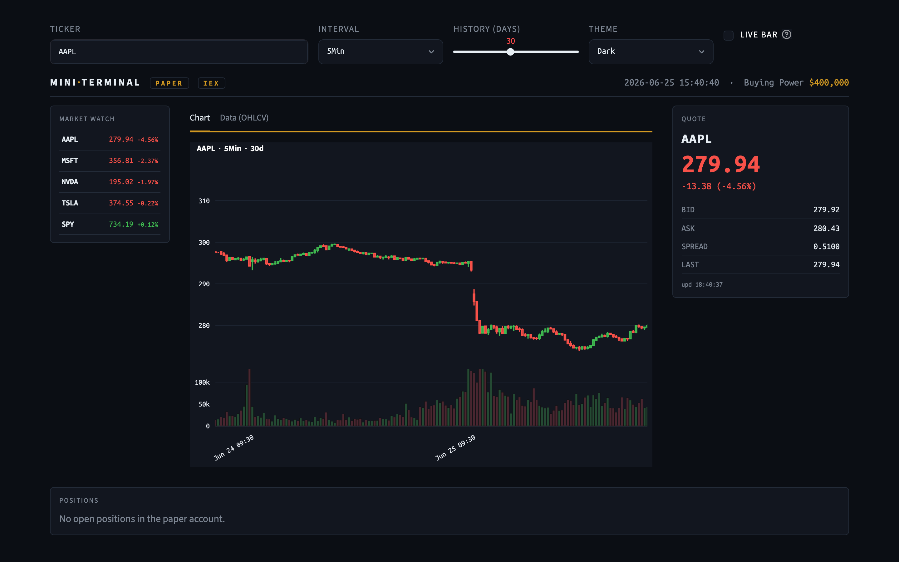
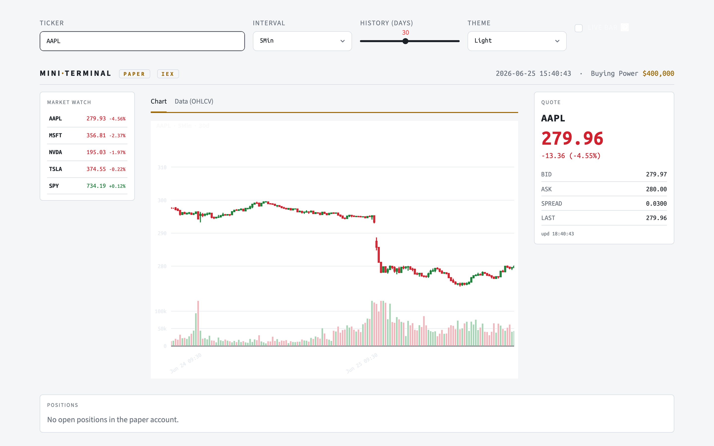

# Mini Market Data Terminal

A small trading terminal built on the [Alpaca](https://alpaca.markets) market-data
API. Type a ticker and get a live quote, a candlestick chart of recent history,
and your paper-trading positions — in an institutional-style terminal UI with a
switchable dark / light theme and a monospaced (Ubuntu Mono) font.




## Features
- **Data connector** (`data_connector.py`) — one tidy wrapper around Alpaca for
  account info, historical OHLCV bars, latest quotes/trades, and the live stream.
  Keys are read from the environment, never hard-coded.
- **Live UI** (`app.py`) — Streamlit terminal: ticker entry, a live bid/ask/last
  quote panel, a candlestick + volume chart, a market-watch list, and a positions
  table. A **Dark / Light theme** toggle restyles the whole terminal (and the
  chart) on the fly, all in a monospaced **Ubuntu Mono** font. The quote,
  watchlist and positions **refresh themselves continuously in the background**
  (Streamlit fragments — no full-page reload); an optional **Live bar** toggle
  grows the forming candle in real time. A second **Data (OHLCV)** tab shows the bars as a themed
  table (newest rows on screen) with one-click **Excel/CSV** download of the full
  set.
- **Quote streamer** (`stream_quotes.py`) — command-line websocket stream of
  real-time bid/ask quotes.

## Quick start (easiest)
One command does everything — installs dependencies, asks for your Alpaca paper
keys the first time, then opens the terminal in your browser. Pick the line for
your operating system:

**macOS / Linux**
```bash
cd Newminimarket
python3 launch.py
```

**Windows**
```bat
cd Newminimarket
py launch.py
```

> Same program everywhere — only the name of the Python command differs. macOS and
> Linux call it `python3`; Windows calls it `py` (or `python`). If one name isn't
> found, try the other.

(On macOS you can also just **double-click `start.command`** in Finder.)

Get paper keys at <https://app.alpaca.markets> → Paper Trading → API Keys. You'll
only be asked once — they're saved to `.env` for next time.

## Manual setup (if you prefer)
**macOS / Linux**
```bash
python3 -m pip install -r requirements.txt
cp .env.example .env          # then edit .env and paste your key + secret
python3 -m streamlit run app.py
```

**Windows**
```bat
py -m pip install -r requirements.txt
copy .env.example .env
rem then edit .env and paste your key + secret
py -m streamlit run app.py
```

## Using the chart
- **Drag** left/right — pan through time
- **Double-click** (or the home icon) — snap back to the full 30 days
- **Mouse-wheel** — zoom in/out
- **Interval / History / Theme / Live bar** controls sit above the terminal; the
  **Data (OHLCV)** tab has the table (newest 500 rows on screen) + Excel/CSV
  download of the full range. The quote, watchlist and positions update on their
  own in the background — there's no refresh button to set.

The chart shows **regular trading hours only (9:30–16:00 ET)** and collapses
weekends, overnight gaps, and market holidays so candles stay flush.

## The command-line quote stream (optional)
A separate, true websocket feed of live bid/ask quotes (use `python3` on
macOS/Linux, `py` on Windows):
```bash
python3 stream_quotes.py AAPL
```

## Notes
- **Paper trading only.** No real money, no order execution — this is a data
  terminal.
- **Market hours.** Live quotes only move 9:30am–4:00pm ET on weekdays. Outside
  those hours everything still loads; the numbers just don't change.
- **One stream at a time.** The free Alpaca plan allows a single live websocket
  connection. Running two streamers at once gives `connection limit exceeded`.
- Free accounts use the **IEX** feed (a subset of US volume), which is fine here.
- **Live updates.** The quote (every ~1s), watchlist and positions refresh
  themselves in the background via Streamlit fragments — no full-page reload and
  no refresh control. Tick **Live bar** to add a live current-price line and grow
  the forming candle; the chart then tracks the most recent bars (turn it off to
  pan/zoom through history).
- **Theme.** The **Theme** dropdown switches the whole terminal between dark and
  light (defaults to dark).
- Always launch with `python3 -m streamlit run app.py` (or `py -m streamlit run
  app.py` on Windows) — not the bare `streamlit` command. Going through Python
  runs the app via the installed Streamlit and avoids stale launcher-script issues.

## Project layout
```
Newminimarket/
├── launch.py           # one-command launcher (deps + keys + open UI)
├── start.command       # double-clickable version of launch.py (macOS)
├── data_connector.py   # all Alpaca access lives here
├── app.py              # Streamlit terminal UI
├── stream_quotes.py    # CLI websocket quote stream
├── requirements.txt
├── .streamlit/         # config.toml — pins the default Streamlit theme
├── .env.example        # template for your keys (real .env is gitignored)
├── GUIDE.md            # full walkthrough + demo script + rubric
├── CHANGELOG.md        # development log: every problem and how it was fixed
├── docs/               # screenshot.png for the README
└── README.md
```
